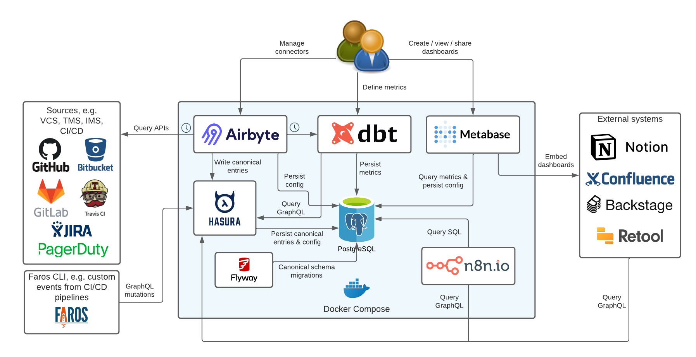

#  Faros Community Edition (CE)

Faros CE is an operational data platform that brings all engineering data in one place to give engineering teams a no-code/low-code BI, API and automation layer for their operational data, usable in minutes.

## 🏁 Quickstart

Follow our [🏁 Quickstart Guide](https://community.faros.ai/docs/quickstart) to connect your engineering systems and explore the metrics, all in a matter of minutes!

## ✨ Features

- **Rich Data Schema**: Connected canonical models for the whole SDLC; 50+ entities, from tasks to deployments
- **Import from a variety of sources**: Easy data import onto our models from Task Management, Version Control, Incident Management, and CI/CD systems
- **Flexible GraphQL API**: Leverage imported data for automation / exploration in our canonical representation
- **Preconfigured dashboards**: View well known engineering metrics such as [DORA](https://cloud.google.com/blog/products/devops-sre/using-the-four-keys-to-measure-your-devops-performance) and [SPACE](https://queue.acm.org/detail.cfm?id=3454124)
- **Extensibility and shareability**: Build and share custom metrics and dashboards
- **Container based deployment**: Run on your laptop, private or public cloud, with no external dependencies

## ℹ️ Components

Built **100%** with open-source components:

- **[Airbyte](https://airbyte.com)**: Data integration platform for importing data from a [variety of sources](https://github.com/faros-ai/airbyte-connectors) (even [more sources](https://github.com/airbytehq/airbyte/tree/master/airbyte-integrations/connectors))
- **[Hasura](https://hasura.io)**: GraphQL engine that makes your data accessible over a real-time GraphQL API
- **[Metabase](https://metabase.com)**: Business Intelligence (BI) tool for generating metrics and rendering charts and dashboards from your data
- **[DBT](https://www.getdbt.com)**: Data transformations to convert raw data into usable metrics
- **[n8n](https://n8n.io/)**: Extendable workflow automation of top of your data
- **[PostgreSQL](https://www.postgresql.org)**: Stores all the your data in canonical representation
- **[Docker](https://www.docker.com)**: Container runtime to run the services
- **[Flyway](https://flywaydb.org)**: Schema evolution for the database schema
- **[Faros Events CLI](https://github.com/faros-ai/faros-events-cli)**: CLI for reporting events to Faros platform, e.g builds & deployments from your CI/CD pipelines

## 🤗 Community support

For general help using Faros CE, please refer to the [official documentation](https://community.faros.ai). For additional help, you can use one of these channels to ask a question:

- **[Slack](https://community.faros.ai/slack)**: Live discussions with the Community and Faros team
- **[GitHub Issues](https://github.com/faros-ai/faros-community-edition/issues)**: Bug reports, suggestions, contributions

Follow us on [Twitter](https://twitter.com/Faros_AI) or [LinkedIn](https://www.linkedin.com/company/faros-ai/) to get the latest company news.

## 📜 License

[Apache License 2.0](LICENSE)
