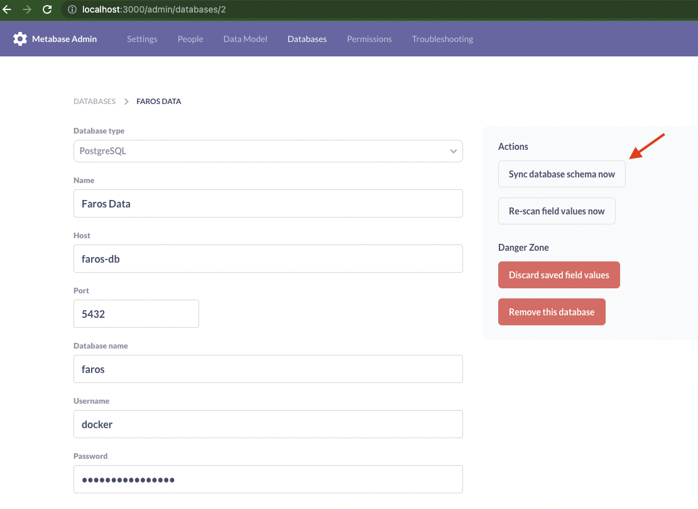
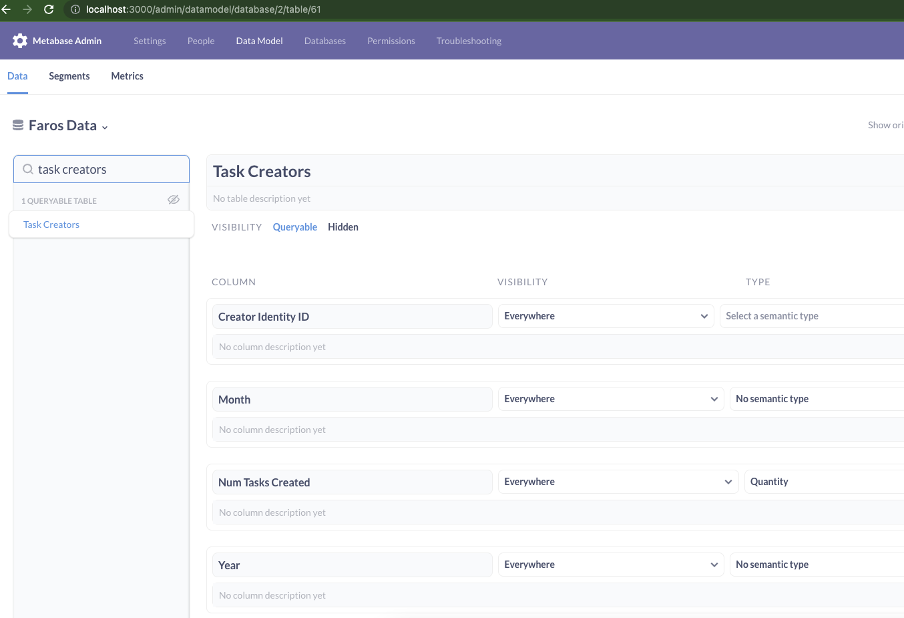
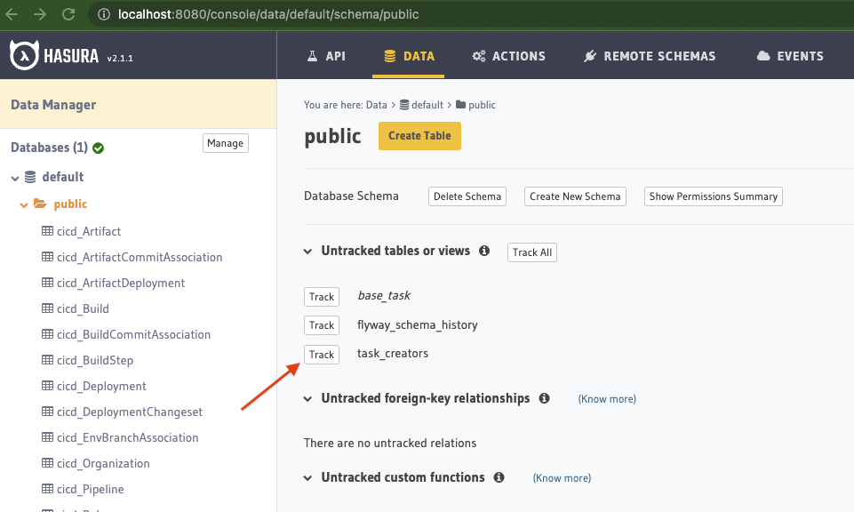
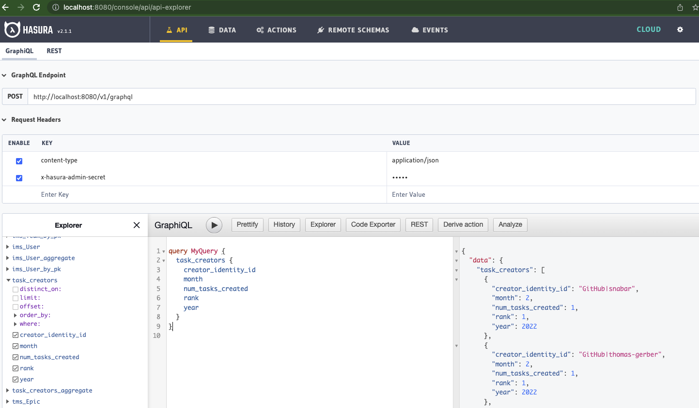

A simple project to showcase dbt transforms on [Faros Community Edition](https://github.com/faros-ai/faros-community-edition)

Assumes you have ingested task data. Otherwise, please follow our [quickstart](https://community.faros.ai/docs/quickstart)

# Usage

1. Export the Faros DB connection details and credentials. Please find the values in the [.env](https://github.com/faros-ai/faros-community-edition/blob/main/.env) file.

```
export DBT_HOST=<FAROS_DB_HOST in .env>
export DBT_PORT=<FAROS_DB_PORT in .env>
export DBT_USER=<FAROS_DB_USER in .env>
export DBT_PASS=<FAROS_DB_PASSWORD in .env>
export DBT_DBNAME=<FAROS_DB_NAME in .env>
```

2. Run the dbt transformation

```
dbt run
```

3. Find the Faros DB in [Metabase](http://localhost:3000/admin/databases) and sync the database schema



You should be able to see the new table in the Data Model tab



4. Optional: Track the new table in [Hasura](http://localhost:8080/console/data/default/schema/public)



You should be able to query the new table

